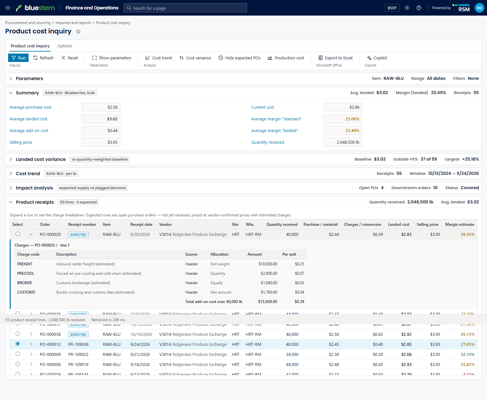
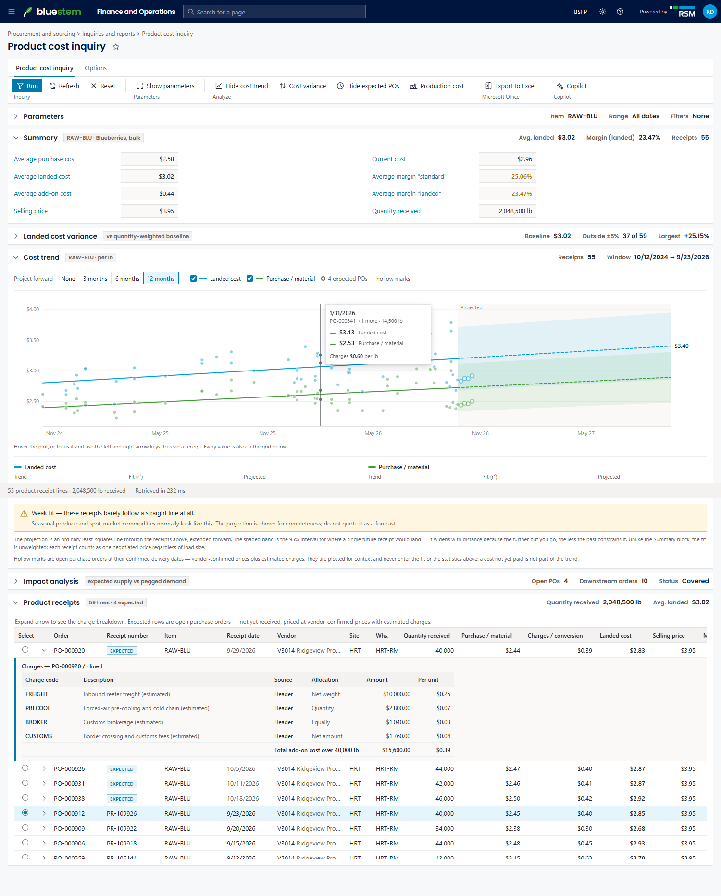
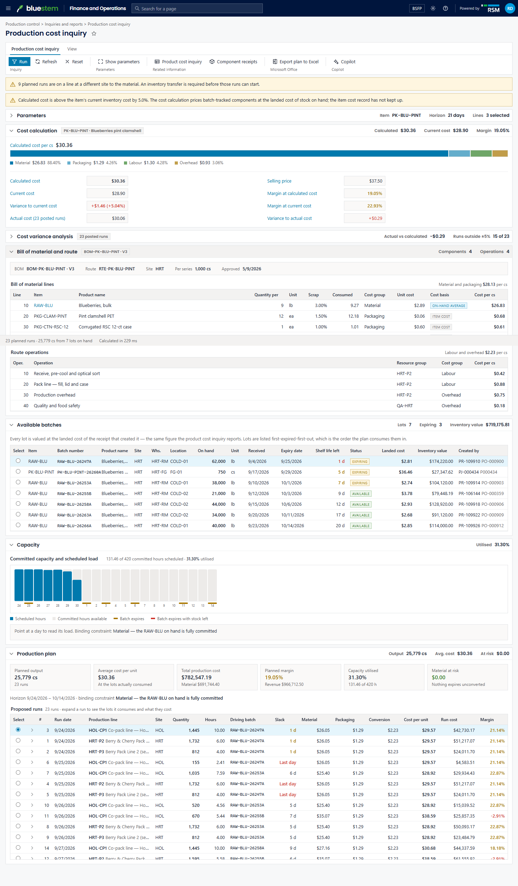

# Product and production cost inquiry

Two Dynamics 365 Finance and Supply Chain–styled inquiry pages that follow one
cost from the dock to the production plan.

**Product cost inquiry** shows, for one item, every posted inventory receipt with
its **landed cost** — purchase price plus allocated add-on charges, or BOM
material plus conversion cost for a produced item — and the resulting margin
against the selling price.

**Production cost inquiry** takes a produced item and answers the next three
questions: what does a unit cost to make, what material is actually on hand and
how long before it expires, and what should be run — costed at the actual lots
each run consumes.

Built to match the Excel "Product Cost Inquiry" prototype, with the F&O
look and feel (navigation pane, action pane, FastTabs, lookup fields, data grid)
so they read as native pages rather than a bolt-on web app.



---

## Quick start

```bash
npm install
npm run dev          # http://localhost:5173
```

Out of the box it runs on **seeded demo data with no network calls**, so it
demos on a plane or behind a customer firewall. Item `F440` is pre-filled;
press **Run**.

The hamburger at the top left opens the navigation pane. The two pages are also
addressable directly — `#/product-cost` and `#/production-cost`, each accepting
`?item=FG816` — which is how they hand an item to each other.

### The demo data

A food and beverage manufacturer that buys bulk produce and dry commodities and
packs them into branded finished goods. All four items are set up for **batch
actual costing**, so a produced batch carries the actual cost of the raw-material
batch it consumed rather than a standard.

| Item     | Description            | Unit | Source                                       |
| -------- | ---------------------- | ---- | -------------------------------------------- |
| `F440`   | Bulk Avocados ORG 40   | lb   | Purchased — imported, cold chain             |
| `RAW541` | Raw Black Beans Bulk   | lb   | Purchased — domestic dry                     |
| `FG816`  | AVOCADO 40 4CT         | ea   | Produced — 2.5 lb of `F440` per pack         |
| `FG841`  | Canned Black Beans     | cs   | Produced — 6 lb of `RAW541` per case of 24   |

Raw material arrives on purchase orders from vendor **R1002 Davis Enterprises**
and is received into **site 2, warehouse 24**. Finished goods are reported as
finished against production orders into warehouse 26, with about a fifth of the
volume packed at the site 3 co-packer.

Ten hand-authored **anchor rows** carry the demo script and never move:

| Order       | Receipt      | Item     | Qty        | FOB / material | Charges | Landed  |
| ----------- | ------------ | -------- | ---------- | -------------- | ------- | ------- |
| `PO-000241` | `PR-104812`  | `F440`   | 42,000 lb  | $2.35          | $0.42   | $2.77   |
| `PO-000258` | `PR-105196`  | `F440`   | 38,000 lb  | $2.35          | $0.31   | $2.66   |
| `PO-000273` | `PR-105644`  | `F440`   | 40,000 lb  | $2.35          | $0.55   | $2.90   |
| `P000318`   | `PJ-000318`  | `FG816`  | 12,400 ea  | $6.93          | $1.00   | $7.93   |
| `P000341`   | `PJ-000341`  | `FG816`  | 11,200 ea  | $6.65          | $0.97   | $7.62   |
| `P000369`   | `PJ-000369`  | `FG816`  | 12,000 ea  | $7.25          | $1.04   | $8.29   |

Three avocado receipts at an identical $2.35 FOB price land at $2.77, $2.66 and
$2.90 — and the three FG816 runs that consumed them come out at $7.93, $7.62 and
$8.29. Expand a production row to see which batch it consumed. `PO-000273` is
the load that sat at the port: demurrage alone adds $0.06/lb, and it is the
reason the 5/26 production run is the least profitable of the three.

The remaining rows are generated from a fixed seed over the trailing 24 months,
so the date filters have something to do and the same screenshot reproduces
weeks later. Every item's `currentCost` sits a few percent under the weighted
average landed cost of its own receipts, which is what the summary block's two
margin figures are there to expose.

Generated purchase prices are **base price × secular drift × seasonal cycle ×
noise**, and charges carry their own steeper inflation on top. Without that
structure the trend chart would have nothing to find — and with it, landed cost
climbs faster than the goods do, which is the argument the app is making. Each
item's drift and seasonal amplitude are on its catalogue entry.

### Background items

A further 17 items (`FILLER_ITEMS` in [seed.ts](web/src/data/seed.ts)) sit behind
the four above — dry commodities, produce, ingredients, packaging and five more
produced SKUs — spread across five other vendors and receiving into site 1
warehouse 12 and site 3 warehouse 31 as well as site 2. They carry no
hand-authored rows and nothing in the demo script points at them. They exist so
the item lookup reads like a real product master, the site and warehouse filters
have somewhere else to point, and a prospect who types a different item number
gets a populated grid rather than an empty one. 354 rows across 21 items in
total.

**They are generated from a separate PRNG stream**, so the background catalogue
can be added to, cut down or re-priced without moving a single figure on the four
focus items — the two passes never share a draw. If you edit `FILLER_ITEMS`, run
`node verify.mjs`: the anchor assertions fail loudly if the streams ever cross.

---

## Architecture

The UI never talks to a data source directly. It codes against one interface,
[`ProductCostProvider`](web/src/providers/types.ts), with three implementations:

| Provider  | What it does                                                        | Needs                          |
| --------- | ------------------------------------------------------------------- | ------------------------------ |
| `mock`    | Deterministic seeded data, in-browser                                | nothing                        |
| `odata`   | Standard D365 data entities, joined and allocated client-side        | proxy + environment            |
| `service` | Custom X++ service, joined and allocated server-side                 | proxy + deployed package       |

Switching is a one-line change in `web/.env`:

```
VITE_DATA_PROVIDER=mock      # or odata | service
```

```
browser  ──►  Node proxy  ──►  D365 F&SCM
             (holds the        OData entities
              client secret)   or custom service
```

**Why the proxy is not optional.** F&O's OData endpoint does not send CORS
headers, so a browser cannot call it cross-origin no matter how the token is
obtained. Separately, the Azure AD client secret must never reach the bundle.
The proxy stays deliberately thin — auth and passthrough only — so the cost
maths has exactly one implementation rather than two.

---

## Formulas

All defined in one place, [`web/src/lib/calc.ts`](web/src/lib/calc.ts), so the
three providers cannot drift apart.

```
landedCost      = purchasePriceFob + financialChargesAoc      (per unit)
marginEstimate  = (sellingPrice - landedCost) / sellingPrice
                                                              purchased | produced
                purchasePriceFob    ......................... FOB price | BOM material cost
                financialChargesAoc ... allocated add-on charges | conversion cost

averagePurchaseCost   = Σ(fob    × qty) / Σqty                (quantity-weighted)
averageAddOnCost      = Σ(aoc    × qty) / Σqty
averageLandedCost     = Σ(landed × qty) / Σqty

averageMarginStandard = (sellingPrice - currentCost)       / sellingPrice
averageMarginLanded   = (sellingPrice - averageLandedCost) / sellingPrice
```

Two notes:

- Averages are **quantity-weighted**, not simple means. A 5-unit receipt should
  not move the average as much as a 5,000-unit receipt.
- The **source spreadsheet's summary block was not internally consistent** with
  its own grid rows — e.g. `Average Add on Cost` of 8.12 against three rows whose
  weighted average is 9.20, and `Average Margin "Standard"` of 38.42% where 39.95
  and 24.20 give 39.42%. The formulas above are what its labels actually
  describe, not what its cells computed.

### Why the add-on cost moves

`F440` lands at $2.77, $2.66 and $2.90 across three receipts that all bought
avocados at $2.35. That spread is the whole point of the inquiry, and it comes
from **charge allocation**: F&O stores a header charge once against the order,
not per line. Turning it into a per-unit cost means

1. spreading the amount across every line of the order by the order's allocation
   method (net amount, quantity, net weight, equally) — including lines for
   *other* items and other lots, because they absorbed part of the freight too,
   then
2. prorating the receiving line's share by how much of the ordered quantity that
   particular receipt covered.

Which charges an order attracts depends on what is on it: imported avocados pick
up customs brokerage, duty and pre-cooling; domestic dry beans pick up
fumigation instead; a mixed load gets only what applies to both.

Expand any grid row to see the breakdown that produced its figure.

---

## Cost trend

**Cost trend** on the action pane plots the receipts the inquiry just returned
against time, fits a least-squares trend to each series, and optionally extends
it 3, 6 or 12 months forward.



Two series on **one** y-axis, because both are currency per unit and a second
scale would invent a relationship that isn't in the data. The gap between them
is the add-on cost, so the two lines diverging over time *is* the finding: on
`F440` the purchase price climbs about $0.16 per lb per year while landed cost
climbs $0.21, because freight, fuel and port charges are inflating faster than
the avocados are.

The maths lives in [`web/src/lib/trend.ts`](web/src/lib/trend.ts), deliberately
apart from `calc.ts`:

- **The fit is unweighted**, where every average in the Summary block is
  quantity-weighted. Those answer different questions. Summary asks what
  inventory actually cost, so a 42,000 lb receipt should count for more than a
  4,000 lb one. The trend asks where *price* is heading, and a big load is not a
  stronger signal about next quarter's market than a small one.
- **The shaded band is a 95% prediction interval for a single future receipt** —
  not the much narrower interval for the fitted line itself. It widens with
  distance from the centre of the data, which is the visual warning a reader
  needs when the dashed part of the line starts looking authoritative.
- **Small samples use Student's t, not 1.96.** With a dozen receipts the normal
  approximation is meaningfully too narrow and would overstate confidence.
- **A fit of two points is refused.** Two points always fit perfectly and would
  report an r² of 1.

### Honesty about the projection

This is a straight line extended past the last observation, not a forecasting
model, and the UI is built to say so. Every series reports its own **r²** beside
its slope, and a message under the chart translates it: strong, some, or *"these
receipts barely follow a straight line at all — do not quote it as a forecast."*

That last case is not hypothetical. Query `F410` (Bulk Mangos) and the fit
collapses to about 3%, because a hard seasonal cycle is not a trend and a linear
model cannot see it. The chart shows the scatter, reports the weak fit, and
declines to pretend. A demo that draws a confident line through seasonal produce
prices is worse than one that admits the scatter.

### Reading it

Hover anywhere on the plot for a crosshair that snaps to the nearest receipt and
a tooltip carrying its order, quantity, both plotted values and the charges
behind them. Focus the plot and the left/right arrow keys step through the same
receipts. Nothing is gated behind the hover — the grid directly below is the
table view, and it holds every value the chart draws.

Colours are the D365 brand blue and Fluent orange, validated as a categorical
pair against the white chart surface (worst-pair CVD ΔE 23.9 and normal-vision
ΔE 31.4, against floors of 8 and 15; both ≥ 3:1 contrast). Series identity never
rests on colour alone: the checkbox row doubles as the legend and every value is
also in the grid.

---

### Purchase and production in one grid

A produced item has no vendor and no FOB price, but reporting it as finished is
still an inventory receipt with a per-unit cost, so it shares the grid. The
`sourceType` field on
[`ReceiptRow`](web/src/types/domain.ts) is what keeps the labelling honest — the
Order column drills to `ProdTableListPage` rather than `PurchTableListPage`, the
Vendor column reads *Produced*, and the two cost columns carry material and
conversion cost instead of FOB and add-on charges.

The OData and service providers return purchase-side receipts only; `sourceType`
is optional and absent means `Purchase`.

---

## Production cost inquiry

**Production control ▸ Inquiries and reports ▸ Production cost inquiry.** Item
`FG816` is pre-filled; press **Run**.



The page reads top to bottom as one argument.

**Cost calculation** rolls the bill of material and the route up into a cost per
finished unit, split into the four D365 cost groups, and sets it against two
other numbers: the cost carried on the item master, and the quantity-weighted
actual cost of the item's posted production receipts. Batch-tracked components
are priced at the **quantity-weighted landed cost of the lots currently on
hand** — not at a standard — so the calculated cost moves when your inventory
does. When the gap to the item cost record exceeds 5% the page says so in a
message bar rather than quietly using it.

`FG841` Canned Black Beans is the case worth demoing: the item master carries
$10.47, the roll-up at today's landed costs comes to **$12.39**, and the margin
a planner thinks they are making (38.2%) is not the margin they are making
(26.9%). Twenty-four cans now cost more than the beans that go in them.

**Bill of material and route** is the evidence behind that number — every
component with its quantity per, scrap percentage, cost group, unit cost and the
basis that unit cost came from. A batch-tracked component links back to the
product cost inquiry for its own receipts.

**Available batches** is the join between the two pages. Every lot is valued at
the landed cost of the receipt that created it — the same figure the product cost
inquiry reports for that receipt — carries an expiry date derived from the
receipt date plus the item's shelf life, and is listed first-expired-first-out.

**Production plan** consumes those lots FEFO and places each run on the earliest
line-day that can still finish before the lot it draws from expires. Cost per
unit therefore differs run to run on the same line making the same item, which
is what batch actual costing means. Expand a run to see the lots behind it.

### What constrains the plan

Two things, and the page says which one is binding.

*Material* — the batch-tracked component covering the fewest finished units is
the driver. *Capacity* — each line commits a number of **hours per day to this
item**, not the hours the line physically exists for, because a line that also
runs three other SKUs cannot give this plan all of them. Committed hours is the
number a planner actually negotiates over, so it is the knob the parameters
expose.

Material that cannot be converted before it expires is reported as **at risk**,
with a value against it, per lot, with the reason.

### The demo

Run `FG816` on the two default avocado pack lines. The oldest lot expires
tomorrow and there are not enough committed hours to convert it: the plan puts
roughly **$40,000 of avocados** in the at-risk block.

Open the parameters, tick **PL-CP1 Co-pack line**, and run again. At risk goes to
zero, planned output rises by about 5,600 packs, and a message bar points out
that nine of those runs are on a line at a different site to the material and
need an inventory transfer first.

That is the argument the whole app is making, end to end: the cost you paid for a
specific lot decides both what the finished good costs and whether it is worth
running at all.

### Honesty about the model

- **On-hand is derived from receipts, never invented.** A lot exists because a
  product receipt or a report-as-finished created it. The hand-authored inbound
  lots (`data/seed.ts`, `INBOUND_ANCHORS`) state their quantity exactly so the
  demo is stable; every other lot is depleted by a **stock-turn model** — a lot
  `turnDays` old has been issued — because the seed has no sales orders or
  inventory journals to net against. That model is the one place the numbers are
  not strict receipts-minus-issues, and it is confined to
  [`data/productionSeed.ts`](web/src/data/productionSeed.ts).
- **The plan is day-granular and single-level.** A run occupies part of one day
  on one line; BOMs are not exploded through sub-assemblies.
- **Packaging is assumed available.** Only batch-tracked components net against
  on-hand and constrain the plan.
- **Calculated cost will not equal the historical production receipts**, because
  the receipts were posted against the conversion rates of their day and the
  roll-up prices components at today's landed costs. That gap is the variance the
  page reports, not an error.

### Live data

**Not implemented.** The product cost inquiry could be written speculatively
because it joins four entities whose shape is at least stable; this one cannot.
A faithful implementation has to read the active BOM version for the item and
site, explode it, read the route and its cost categories, read on-hand by batch
across inventory dimensions, and read batch expiry dates — and the entity names,
the version effectivity rules and the on-hand aggregation differ enough between
environments that a guess would return a plausible wrong cost rather than an
obvious error.

The `odata` and `service` providers therefore raise a named error naming the
config file. The entity sets a real implementation would need, and how to probe
your environment for them, are listed under **PRODUCTION INQUIRY — NOT MAPPED**
in [`web/src/lib/odataConfig.ts`](web/src/lib/odataConfig.ts). Run this page on
`VITE_DATA_PROVIDER=mock` until they are confirmed.

---

## Connecting to a live environment

### 1. Azure AD app registration

Create an app registration, add a client secret, then register the same
application in F&O under
**System administration ▸ Setup ▸ Microsoft Entra ID applications**, mapped to a
user with the required duties.

### 2. Configure the proxy

```bash
cp server/.env.example server/.env    # fill in URL, tenant, client id, secret
npm run dev:server                    # http://localhost:8787
```

Confirm it:

```bash
curl http://localhost:8787/api/health
```

### 3. Reconcile the entity names — do this before anything else

**Public data-entity names and their field names drift between F&O versions**
and depend on which features an environment has enabled. Every name the app
depends on lives in one file,
[`web/src/lib/odataConfig.ts`](web/src/lib/odataConfig.ts), and the entries most
likely to differ are marked `CONFIRM`.

The proxy ships a probe so reconciling takes about two minutes:

```bash
curl "http://localhost:8787/api/probe?q=receipt"          # find the entity set
curl "http://localhost:8787/api/probe?q=charge"
curl "http://localhost:8787/api/probe/PurchaseOrderLines" # list its real fields
```

The probe reads the OData **service document** and one live record rather than
`$metadata` — F&O's `$metadata` is tens of megabytes of XML and answers the same
question far more slowly.

If an entity set is wrong, the app raises an error naming the exact config key
to fix rather than failing silently.

### 4. Point the app at it

```bash
cp web/.env.example web/.env
# VITE_DATA_PROVIDER=odata
# VITE_COMPANY=USMF
# VITE_D365_URL=https://yourenv.sandbox.operations.dynamics.com   (enables drill-through)
npm run dev:all
```

Setting `VITE_D365_URL` turns the PO number, receipt number and item columns
into deep links back into F&O. Left unset, they render as plain text rather than
dead links.

---

## Custom service (recommended for production)

The OData path has two limitations it cannot resolve from outside F&O, both
surfaced in the UI as warnings rather than hidden:

- **Net-weight allocation** needs a per-line net weight, which the purchase
  order line entity does not expose. Those charges fall back to a net-amount
  split.
- **Financial vs. stock classification** depends on the charge code's debit
  posting type, which is not on the charge entities. Without it, every charge is
  treated as financial, or you hard-code a list in `FINANCIAL_CHARGE_CODES`.

Both are read directly by the X++ service in [`dynamics/`](dynamics/), which
also collapses four round trips into one. See
[dynamics/README.md](dynamics/README.md) for the deployment steps.

---

## Layout

```
web/                          Vite + React 18 + TS + Tailwind
  src/types/domain.ts         Receipts and landed cost — the shared contract
  src/types/production.ts     BOM, on-hand batches, lines, the plan
  src/providers/              mock | odata | service, behind one interface
  src/lib/calc.ts             Landed cost, margin, charge allocation
  src/lib/production.ts       BOM roll-up, FEFO allocation, capacity scheduling
  src/lib/trend.ts            Least-squares fit + prediction interval
  src/lib/route.ts            Hash routing — two pages, no router dependency
  src/lib/odataConfig.ts      ← entity + field names live here, nowhere else
  src/data/seed.ts            Receipts: anchors + two PRNG streams
  src/data/productionSeed.ts  BOMs, routes, shelf lives, lines, on-hand
  src/components/d365/        F&O kit (shell, nav pane, action pane, FastTab, grid)
  src/pages/                  The two inquiries
server/                       Node proxy: Azure AD auth, OData passthrough, probe
dynamics/                     X++ service + data contracts
verify.mjs                    Renders the app in Edge and asserts the numbers
```

All cost maths lives in `lib/calc.ts` and `lib/production.ts`, which are pure
functions over data a provider hands in — so the mock, OData and custom-service
providers cannot drift apart on what something costs.

## Verifying

```bash
npm run dev        # one terminal
node verify.mjs    # another — asserts the anchor rows still hold
```

34 checks.

*Product cost inquiry* — the three `F440` anchors, that raw material only ever
lands in site 2 / warehouse 24, the three `FG816` production anchors, that a
production row traces back to the batch it consumed, that landed cost trends up
faster than purchase price and a longer horizon projects further along it, that
the background items return rows across more than one warehouse, and that an
unknown item errors cleanly.

*Production cost inquiry* — that the navigation pane routes to it, that the BOM
lists real component items with the basis each was priced on, that a BOM quantity
of 0.00025 does not round to zero against a real cost, that runs of the same item
carry **different** costs per unit because they consume different lots, that the
plan quantifies the material that will expire unconverted, that **enabling the
co-pack line takes at-risk to zero and raises output**, that a long-shelf-life
item has nothing at risk, that the variance to the item cost record is reported,
and that a component drills back through to its receipts.

Writes `verify-inquiry.png`, `verify-production.png`, `verify-trend.png` and
`verify-production-plan.png`.

Uses system Edge via `channel: 'msedge'`; the Playwright browser CDN is blocked
by the corporate proxy.

## Deploying the demo

**Live:** <https://www.rsmd365.com/product-cost-tracker/>

Every push to `main` rebuilds and republishes it — `.github/workflows/deploy.yml`
builds the `web` workspace with `BASE_PATH=/product-cost-tracker/` and uploads
`web/dist` to GitHub Pages. Nothing is deployed by hand.

To reproduce that build locally:

```bash
BASE_PATH=/product-cost-tracker/ npm run build   # → web/dist
```

Keep `VITE_DATA_PROVIDER=mock` for a public static host — the `odata` and
`service` providers need the proxy, which cannot run on GitHub Pages. Routing is
hash-based, so no SPA rewrite rules or `404.html` fallback are needed.
